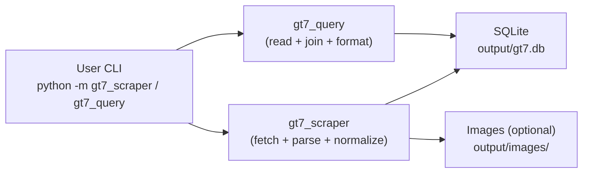
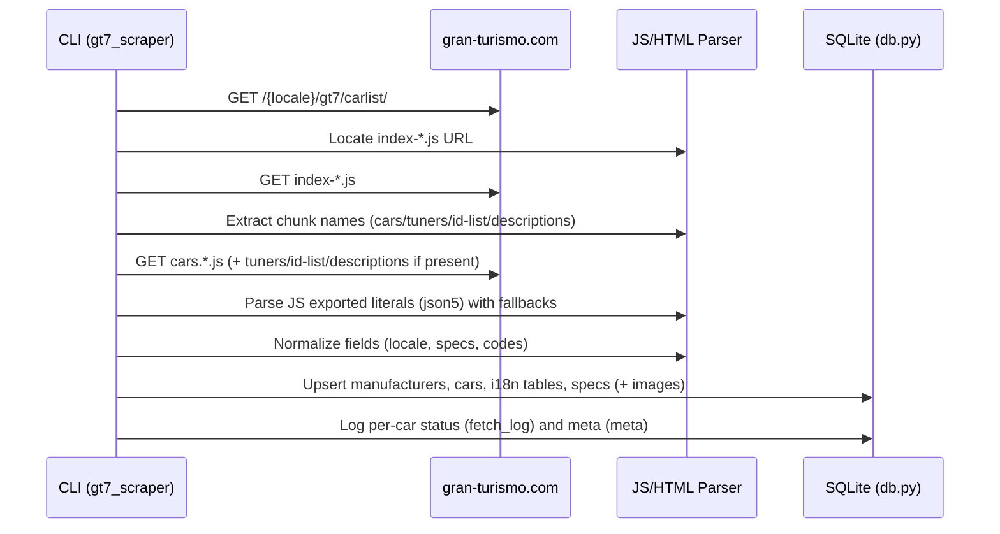
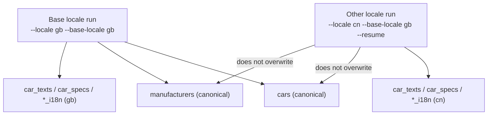

# Architecture & Data Flow

[English](ARCHITECTURE.md) | [简体中文](ARCHITECTURE.zh-CN.md)

This document explains how the repository is structured, how the scraper works end-to-end,
and how data is stored and queried.

## What This Repo Produces
- A SQLite database (default: `output/gt7.db`)
- Optional local image assets (default: `output/images/`)
- No scraped datasets are committed to the repository (see `LEGAL_AND_PUBLISHING.md`)

## Repository Layout (High Level)
- `gt7_scraper/`: fetches GT7 car catalog data and writes into SQLite (+ optional images)
- `gt7_query/`: reads the SQLite database and provides CLI + Python API for consumers
- `docs/`: workflow, schema, and publishing guidance
- `output/`: default runtime output (ignored by git)

## Architecture Overview

## Scraper Pipeline (Data Sources and Stages)

### Data sources on the official site
The GT7 car list page loads a small HTML shell, then references a hashed JS bundle
(`index-*.js`) which in turn references hashed "chunk" files containing data such as:
- car catalog data (`cars.<asset_locale>-<hash>.js`)
- manufacturer/tuner data (`tuners.<asset_locale>-<hash>.js`)
- optional car ID list (`cars-id-list.<asset_locale>-<hash>.js`)
- optional description text (`descriptions.<asset_locale>-<hash>.js`)

### Main pipeline

### Optional Playwright fallback
When `--use-playwright` is enabled, Playwright can be used as a fallback for:
- missing intro/detail text
- missing or lazy-loaded images (hero images and list thumbnails)
- cases where the JS chunk data is incomplete or changes format

Playwright is optional and not required for basic dataset generation (see `DATASET_GENERATION.md`).

## Locale Strategy (Canonical vs Localized)
The database is designed to avoid duplicated "core" rows across locales:
- `cars` and `manufacturers` store a single canonical snapshot controlled by `--base-locale`
- `car_texts`, `car_specs`, and `*_i18n` store per-locale overrides/translations

### Locale path vs asset locale
Some locales use different language codes in URL paths vs asset filenames. The scraper
handles this internally (see `gt7_scraper/scraper.py:resolve_locales`).

Example: a user-facing locale may be `br`, while the site assets might use `bp`.

## Concurrency, Idempotency, and Resume
- Concurrency is controlled by `--workers` and uses a thread pool for per-car processing.
- `--resume` skips cars already marked `success` in `fetch_log` for the requested locale.
- Writes are upsert/replace style, so re-running a locale is safe and useful for updates.

## Observability and Integrity
- `fetch_log` records per-car fetch status and errors by locale.
- `meta` stores values like the official site total count, scraped total count, and a status.
- If the run is not limited (`--limit 0`) and counts mismatch, the scraper returns exit code `2`
  and sets `meta.status = count_mismatch`.

## Related Documentation
- Dataset generation: `DATASET_GENERATION.md`
- Database schema: `DB_SCHEMA.md`
- Query CLI/API: `QUERY_CLI.md`
- Legal guidance: `LEGAL_AND_PUBLISHING.md`
