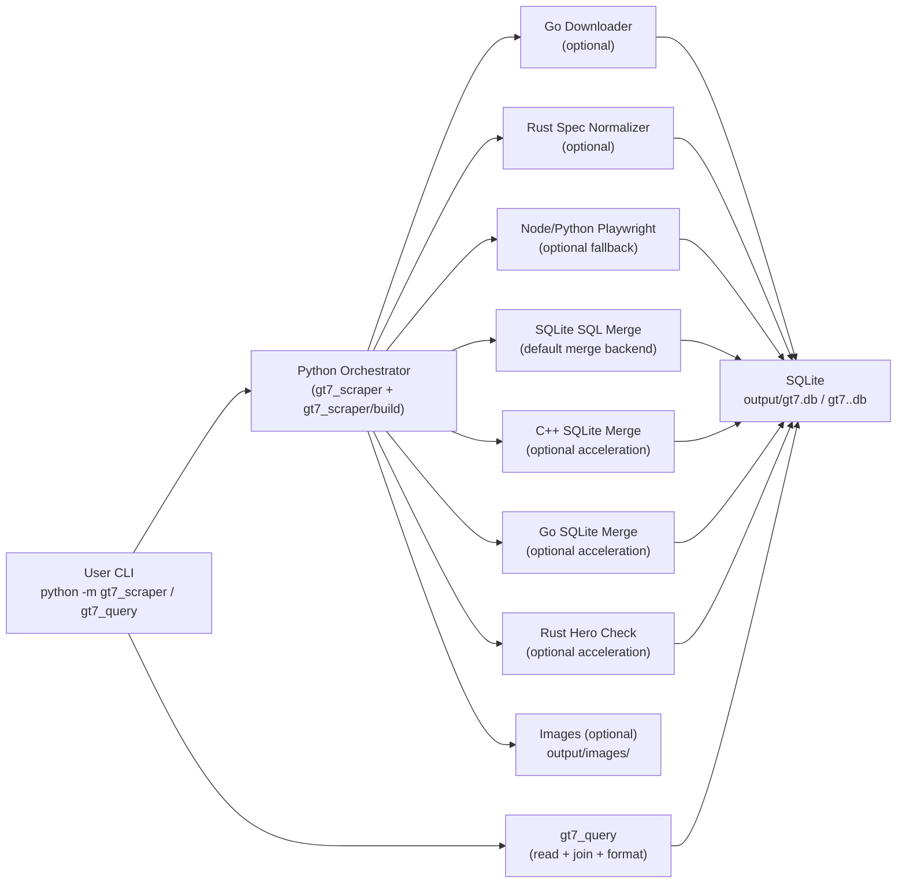
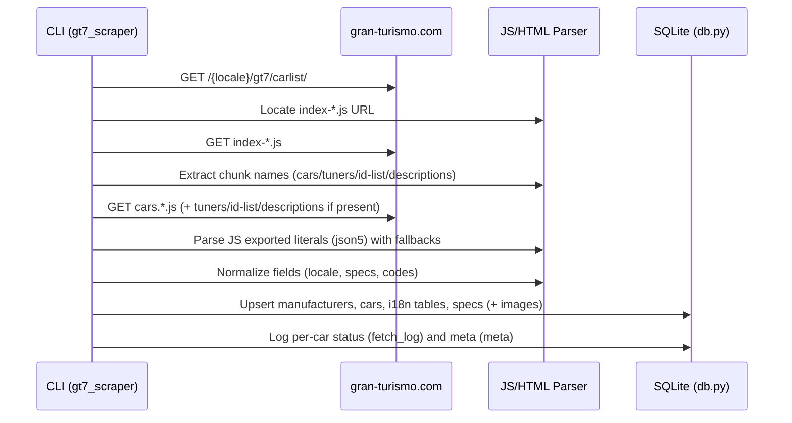
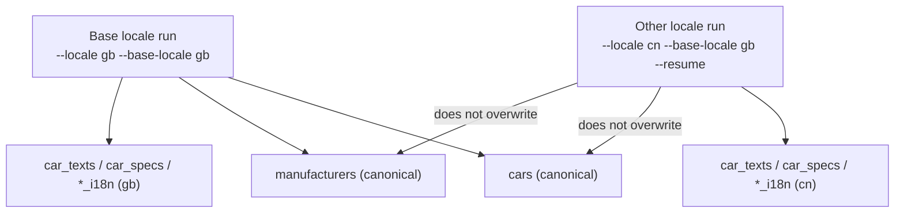

# Architecture & Data Flow

[English](ARCHITECTURE.md) | [简体中文](ARCHITECTURE.zh-CN.md)

This document explains how the repository is structured, how the scraper works end-to-end,
and how data is stored and queried.

## What This Repo Produces
- A SQLite database (default: `output/gt7.db`)
- Optional local image assets (default: `output/images/`)
- No scraped datasets are committed to the repository (see `LEGAL_AND_PUBLISHING.md`)

## Repository Layout (High Level)
- `gt7_scraper/`: fetches GT7 car catalog data and writes into SQLite (+ optional images)
- `gt7_scraper/build/`: build orchestration (`scripts/build_dbs.py`) including progress, merge, hero checks
- `gt7_query/`: reads the SQLite database and provides CLI + Python API for consumers
- `engines/`: optional non-Python accelerators (`gt7_downloader`, `gt7_spec_normalizer`, `gt7_playwright`, `gt7_db_merge_cpp`, `gt7_db_merge_go`, `gt7_hero_check_rust`, `gt7_query_go`, `gt7db_launcher_dotnet`)
- `docs/`: workflow, schema, and publishing guidance
- `output/`: default runtime output (ignored by git)

## Runtime Package Layout (Business First)
The runtime code is organized by business boundaries first, then backend type:
- `gt7_scraper/app/`: scrape/build entry orchestration (`scrape_runner.py`, `build_runner.py`, `scrape_cli.py`)
- `gt7_scraper/domain/`: catalog/spec/images business logic
- `gt7_scraper/backends/`: Python/native adapters (`catalog`, `spec`, `images`, `playwright`)
- `gt7_scraper/infra/`: DB/HTTP/IO infrastructure helpers
- `gt7_scraper/compat/`: compatibility shims for legacy import paths
- `gt7_query/app/`: query CLI entry
- `gt7_query/domain/`: list/detail/stats/overview services
- `gt7_query/backends/`: go/python query backend dispatch
- `gt7_query/infra/`: low-level DB helpers
- `gt7_query/compat/`: compatibility shims for legacy `queries` usage

Notes:
- Top-level `engines/` remains the native source root (Go/Rust/Node/C++/.NET).
- Compatibility modules are transitional and may be removed in a future release.

## Execution Modes
- `--engine python`: minimal dependency baseline implementation.
- `--engine hybrid`: recommended mode; keeps schema/CLI semantics while routing selected hot paths to Go/Rust/Node and SQL/C++ merge backends.

## Language Selection (Project Intent)
This project is intentionally built as a learning/experiment repository. The core functionality can be implemented in pure Python, but multiple languages are used where each one is a better fit:
- Python: orchestration, CLI compatibility, fallback logic, and fast iteration
- SQL (SQLite-first): set-based merge/check operations to reduce Python row loops
- Go: concurrent image download + optional DB merge/query backends (high I/O throughput, static binaries)
- Rust: deterministic spec normalization + optional hero validation backend
- Node/Playwright: browser-side extraction fallback when static assets are incomplete
- C++ (SQLite C API): optional high-throughput merge backend for `gt7.<locale>.db -> gt7.db`
- C#/.NET: optional `gt7db` launcher wrapping Python core entrypoints

Rule of use:
- defaults stay backward-compatible
- every non-Python path has a Python/SQL fallback path

## Architecture Overview

## Scraper Pipeline (Data Sources and Stages)

### Data sources on the official site
The GT7 car list page loads a small HTML shell, then references a hashed JS bundle
(`index-*.js`) which in turn references hashed "chunk" files containing data such as:
- car catalog data (`cars.<asset_locale>-<hash>.js`)
- manufacturer/tuner data (`tuners.<asset_locale>-<hash>.js`)
- optional car ID list (`cars-id-list.<asset_locale>-<hash>.js`)
- optional description text (`descriptions.<asset_locale>-<hash>.js`)

### Main pipeline

### Optional Playwright fallback
When `--use-playwright` is enabled, Playwright can be used as a fallback for:
- missing intro/detail text
- missing or lazy-loaded images (hero images and list thumbnails)
- cases where the JS chunk data is incomplete or changes format

Playwright is optional and not required for basic dataset generation (see `DATASET_GENERATION.md`).

## Locale Strategy (Canonical vs Localized)
The database is designed to avoid duplicated "core" rows across locales:
- `cars` and `manufacturers` store a single canonical snapshot controlled by `--base-locale`
- `car_texts`, `car_specs`, and `*_i18n` store per-locale overrides/translations

### Locale path vs asset locale
Some locales use different language codes in URL paths vs asset filenames. The scraper
handles this internally (see `gt7_scraper/scraper_run.py:resolve_locales`).

Example: a user-facing locale may be `br`, while the site assets might use `bp`.

## Concurrency, Idempotency, and Resume
- Concurrency is controlled by `--workers` and uses a thread pool for per-car processing.
- `--resume` skips cars already marked `success` in `fetch_log` for the requested locale.
- Writes are upsert/replace style, so re-running a locale is safe and useful for updates.

## `build_dbs` Flow (Per-Locale + Combined)
`scripts/build_dbs.py` now supports two combined strategies:
- `--combined-mode rescrape` (default): keeps legacy behavior by appending locale runs directly into `gt7.db`
- `--combined-mode merge`: builds `gt7.<locale>.db` first, then merges into `gt7.db` via `--merge-engine python|cpp|go`

Behavioral compatibility:
- default remains `rescrape`
- `merge` mode is opt-in
- `cpp/go` merge automatically falls back to Python SQL merge on failure
- `--hero-check-engine rust` automatically falls back to Python hero-check on failure

## Observability and Integrity
- `fetch_log` records per-car fetch status and errors by locale.
- `meta` stores values like the official site total count, scraped total count, and a status.
- In `scripts/build_dbs.py`, global `Total` progress denominator is based on the final planned car order (`limit/car-list/resume` applied), not page regex estimates.
- If the run is not limited (`--limit 0`) and counts mismatch, the scraper returns exit code `2`
  and sets `meta.status = count_mismatch`.

## Related Documentation
- Dataset generation: `DATASET_GENERATION.md`
- Hybrid engine: `HYBRID_ENGINE.md`
- Database schema: `DB_SCHEMA.md`
- Query CLI/API: `QUERY_CLI.md`
- Legal guidance: `LEGAL_AND_PUBLISHING.md`
