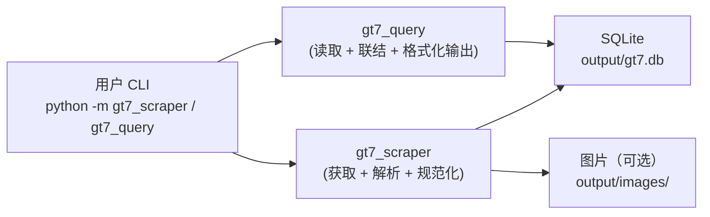
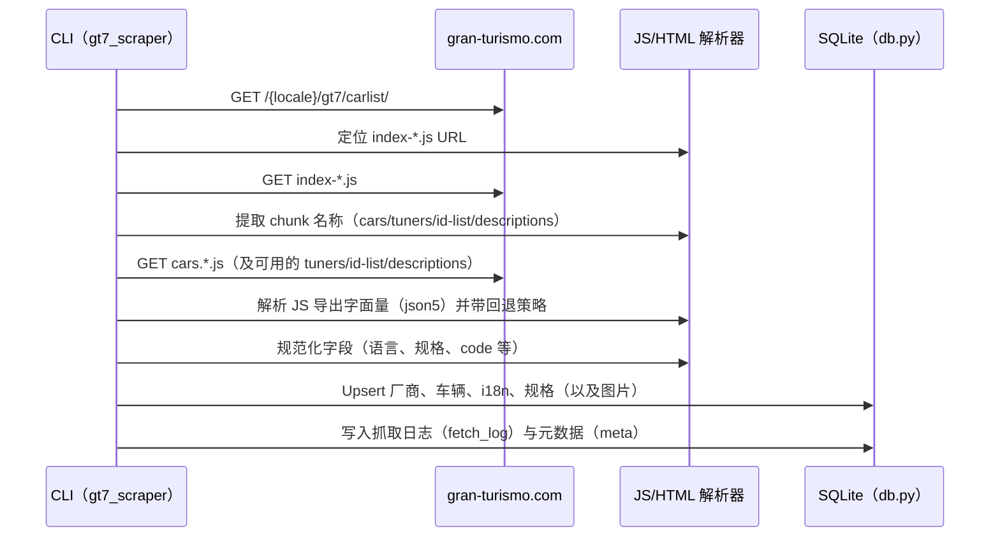
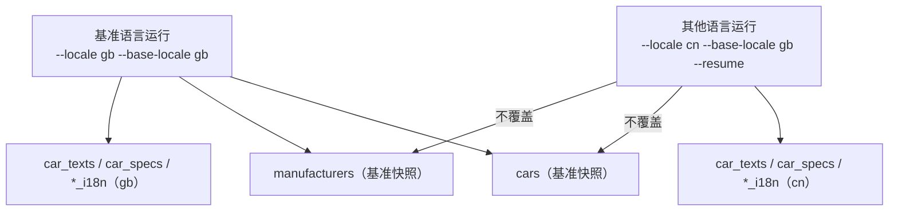

# 架构与数据流

[English](ARCHITECTURE.md) | [简体中文](ARCHITECTURE.zh-CN.md)

本文说明仓库的整体结构、爬虫的端到端工作原理，以及数据如何落库并被查询读取。

## 本项目会产出什么
- SQLite 数据库（默认：`output/gt7.db`）
- 可选的本地图片资产（默认：`output/images/`）
- 仓库本身不包含任何抓取后的数据集或图片资产（见 `LEGAL_AND_PUBLISHING.zh-CN.md`）

## 目录结构（概览）
- `gt7_scraper/`：抓取 GT7 官方车辆目录数据，写入 SQLite（并可选下载图片）
- `gt7_query/`：读取 SQLite，提供 CLI + Python API
- `docs/`：流程、Schema、发布与合规说明
- `output/`：默认运行输出目录（已在 gitignore 中忽略）

## 执行模式
- `--engine python`：当前基线实现。
- `--engine hybrid`：第一阶段优化路径；当前先启用 SQLite WAL 与批量提交，数据语义保持不变。

## 架构总览

## 爬虫流水线（数据来源与阶段）

### 官方站点的数据来源
GT7 车辆列表页通常先返回一份 HTML“壳”，随后引用带哈希的 JS bundle（`index-*.js`）。
该 bundle 会再引用多份带哈希的“chunk”文件，常见类型包括：
- 车辆目录数据（`cars.<asset_locale>-<hash>.js`）
- 厂商/改装商数据（`tuners.<asset_locale>-<hash>.js`）
- 可选的车 ID 列表（`cars-id-list.<asset_locale>-<hash>.js`）
- 可选的简介/描述文本（`descriptions.<asset_locale>-<hash>.js`）

### 主流程

### 可选 Playwright 回退
启用 `--use-playwright` 后，Playwright 作为回退手段用于补全：
- 缺失的 intro/detail 文本
- 缺失或懒加载的图片（详情页 hero 图片、列表缩略图）
- JS chunk 数据缺失或格式变化导致的信息缺口

Playwright 并非生成数据集的必需依赖（详见 `DATASET_GENERATION.zh-CN.md`）。

## 语言策略（基准语言 vs 本地化语言）
数据库的设计目标是避免每种语言都复制一份“核心实体表”：
- `cars` 与 `manufacturers` 只保存一份“基准语言快照”，由 `--base-locale` 控制
- `car_texts`、`car_specs` 与 `*_i18n` 保存各语言的文本覆盖与翻译

### URL 语言码与资源语言码
部分语言在 URL 路径与资源文件名中使用的语言码不同。爬虫会自动处理（见
`gt7_scraper/scraper.py:resolve_locales`），例如用户侧 locale 为 `br`，资源侧可能为 `bp`。

## 并发、可重复运行与恢复
- 并发由 `--workers` 控制，使用线程池按车辆粒度并发处理。
- `--resume` 会基于 `fetch_log` 中的 `success` 记录跳过已成功抓取的车辆（按 locale 区分）。
- 写入采用 upsert/replace 风格，多次运行同一语言是安全的，也可用于更新数据。

## 可观测性与完整性校验
- `fetch_log` 记录每辆车、每种语言的抓取状态与错误信息。
- `meta` 记录官方总数、已抓取总数、整体状态等。
- 若未限制抓取规模（`--limit 0`）且抓取总数与官方总数不一致，会返回退出码 `2`，
  并写入 `meta.status = count_mismatch`。

## 相关文档
- 数据集生成：`DATASET_GENERATION.zh-CN.md`
- 混合引擎：`HYBRID_ENGINE.zh-CN.md`
- 数据库结构：`DB_SCHEMA.zh-CN.md`
- 查询 CLI/API：`QUERY_CLI.zh-CN.md`
- 法律与发布：`LEGAL_AND_PUBLISHING.zh-CN.md`
