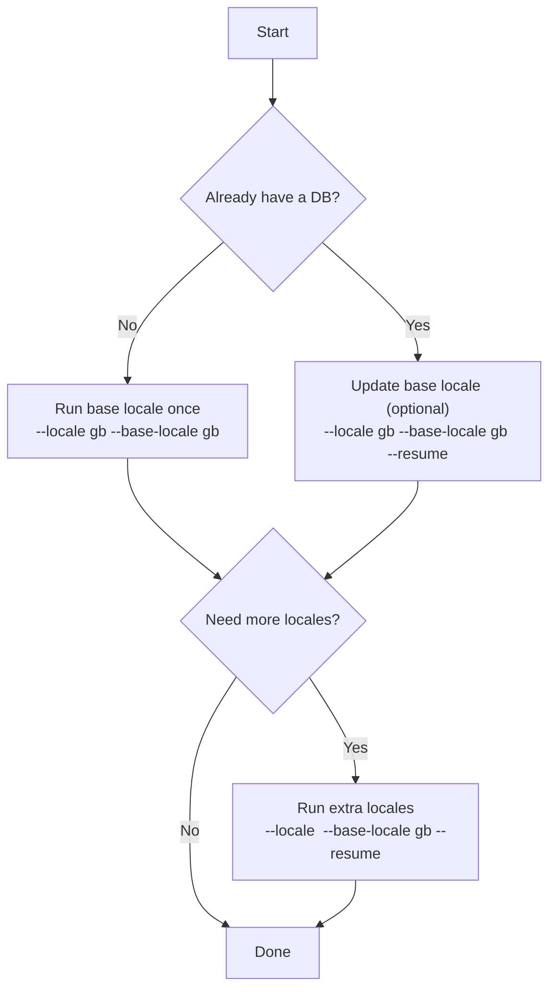

# Dataset Generation

[English](DATASET_GENERATION.md) | [简体中文](DATASET_GENERATION.zh-CN.md)

This document describes how to generate a GT7 SQLite dataset using `gt7_scraper`.
For a conceptual overview (components + data flow), see `ARCHITECTURE.md`.

## What Gets Stored
By default, a run writes:
- Canonical (base-locale) cars and manufacturers into `cars` and `manufacturers`
- Per-locale text/specs into `car_texts` and `car_specs`
- Per-locale labels (specs, drivetrain, aspiration) into `spec_code_i18n`, `drivetrain_i18n`, `aspiration_i18n`
- Per-car status logs into `fetch_log` and run-wide counters into `meta`
- Optional images into `car_images` and `output/images/` (unless `--skip-images`)

## Install
```bash
python3 -m venv .venv
source .venv/bin/activate
pip install -r requirements.txt
```

Optional Playwright fallback (for detail page extraction and list thumbnails):
```bash
pip install playwright
python -m playwright install
```

## Locales
The scraper accepts a locale code and fetches language-specific data:
- `gb`, `us`, `cn`, `tw`, `jp`, `kr`
- `de`, `fr`, `it`, `nl`, `es`, `mx`, `pt`, `br`, `pl`, `ru`
- `cz`, `tr`, `gr`, `sa`, `th`

Notes:
- `--base-locale` controls which locale is considered canonical for `cars` and `manufacturers`.
- Other locales do not overwrite canonical fields in `cars` / `manufacturers`; they populate i18n tables.
- Some locales use different URL/path codes vs asset chunk codes; this is handled automatically.

## Recommended Workflow (Base + Extra Locales)


Example (gb + cn):
```bash
python -m gt7_scraper --locale gb --base-locale gb --db ./output/gt7.db --images ./output/images
python -m gt7_scraper --locale cn --base-locale gb --db ./output/gt7.db --images ./output/images --resume
```

## Small Test Runs
Limit the number of cars while validating your environment:
```bash
python -m gt7_scraper --locale gb --base-locale gb --db ./output/gt7.db --images ./output/images --limit 3
```

Scrape a specific list of cars:
```bash
cat > /tmp/cars.txt <<'EOF'
# one carId per line
car31
car105
EOF

python -m gt7_scraper --locale gb --base-locale gb --db ./output/gt7.db --images ./output/images --car-list /tmp/cars.txt
```

## Flags (Practical Notes)
- `--resume`: skips cars whose latest `fetch_log` status is `success` for the locale you are running
- `--workers N`: parallelizes per-car processing using a thread pool (default: 1)
- `--rate SEC`: sleeps after each processed car (global throttling; default: `0.7`)
- `--timeout SEC`: request timeout used by HTTP fetches (and as an upper bound for Playwright waits)
- `--use-playwright`: enables the Playwright fallback extraction path
- `--playwright-workers N`: uses a dedicated Playwright pool (recommended only when `--use-playwright` is needed)
- `--skip-images`: does not download images and does not create the `car_images` table for new DBs

## Image Handling
When enabled (default), images are downloaded into `--images` with a stable folder structure:
- manufacturer logo: `manufacturers/<manufacturer_id>/logo.<ext>`
- car images: `cars/<car_id>/<car_id>_hero_XX.<ext>` and `cars/<car_id>/<car_id>_thumb_XX.<ext>`

Notes:
- Downloads are idempotent: if a file already exists, it is not re-downloaded.
- Use `--skip-images` for faster runs and to reduce legal risk when publishing.

## Integrity Check and Exit Codes
If `--limit` is not used and no `--car-list` is provided, the scraper compares the scraped
car count to the site total (when available).

On mismatch:
- exit code is `2`
- `meta.status` is set to `count_mismatch`

On success:
- exit code is `0`
- `meta.status` is set to `ok`

## Troubleshooting
- `Failed to locate index JS bundle`: the car list HTML structure changed or the locale path is incorrect; retry later or try a different locale.
- Frequent timeouts: increase `--timeout`, reduce `--workers`, and consider keeping a non-zero `--rate`.
- Missing intro/detail/specs: enable `--use-playwright` (slower, but more robust).
- Count mismatch: re-run without `--resume` (to refresh failures) or inspect failures in `fetch_log`.
