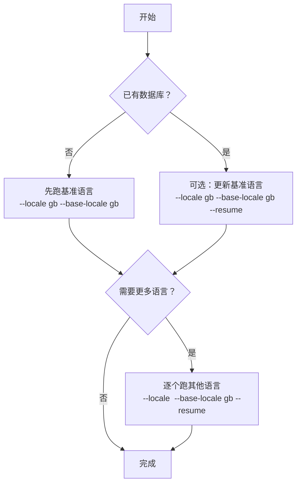

# 数据集生成

[English](DATASET_GENERATION.md) | [简体中文](DATASET_GENERATION.zh-CN.md)

本文说明如何使用 `gt7_scraper` 生成 GT7 的 SQLite 数据集。若需要先了解整体原理与数据流，
请先阅读 [ARCHITECTURE.zh-CN.md](ARCHITECTURE.zh-CN.md)。
混合模式的构建与运行细节见 [HYBRID_ENGINE.zh-CN.md](HYBRID_ENGINE.zh-CN.md)。

## 会写入哪些数据
默认情况下，一次运行会写入：
- 基准（`--base-locale`）的车辆与厂商快照到 `cars` 与 `manufacturers`
- 各语言的文本/规格到 `car_texts` 与 `car_specs`
- 各语言的标签翻译到 `spec_code_i18n`、`drivetrain_i18n`、`aspiration_i18n`
- 每辆车的抓取状态到 `fetch_log`，整体计数与状态到 `meta`
- 可选图片到 `car_images` 与 `output/images/`（除非使用 `--skip-images`）

## 安装
```bash
python3 -m venv .venv
source .venv/bin/activate
pip install -r requirements.txt
```

一键脚本：
```bash
# 纯 Python 模式
./scripts/bootstrap_python_env.sh

# Hybrid 模式（Go + Node + Rust）
./scripts/bootstrap_hybrid_env.sh
```

可选 Playwright 回退（详情页 + 列表缩略图）：
```bash
pip install playwright
python -m playwright install
```

## 语言
爬虫支持以下语言：
- `gb`, `us`, `cn`, `tw`, `jp`, `kr`
- `de`, `fr`, `it`, `nl`, `es`, `mx`, `pt`, `br`, `pl`, `ru`
- `cz`, `tr`, `gr`, `sa`, `th`

说明：
- `--base-locale` 决定 `cars` 与 `manufacturers` 的“基准快照语言”。
- 非基准语言不会覆盖 `cars` / `manufacturers` 的基准字段，只会补充 i18n 表。
- 少数语言在 URL/路径语言码与资源文件语言码上不一致，爬虫会自动处理。

## 推荐流程（基准语言 + 其他语言）


示例（gb + cn）：
```bash
python -m gt7_scraper --locale gb --base-locale gb --db ./output/gt7.db --images ./output/images --skip-images
python -m gt7_scraper --locale cn --base-locale gb --db ./output/gt7.db --images ./output/images --resume --skip-images
```

## 小规模测试
先用 `--limit` 做环境自检：
```bash
python -m gt7_scraper --locale gb --base-locale gb --db ./output/gt7.db --images ./output/images --limit 3
```

仅抓取指定车辆列表：
```bash
cat > /tmp/cars.txt <<'EOF'
# 每行一个 carId
car31
car105
EOF

python -m gt7_scraper --locale gb --base-locale gb --db ./output/gt7.db --images ./output/images --car-list /tmp/cars.txt
```

## 常用参数
- `--engine python|hybrid`：选择执行模式（`hybrid` 当前会启用 SQLite WAL + 批量提交）
- `--commit-batch N`：每 N 辆车提交一次事务（默认：`python=1`，`hybrid=50`）
- `--sqlite-wal` / `--no-sqlite-wal`：显式开启或关闭 WAL 模式
- `--engines-dir PATH`：混合模式外部二进制的解析目录
- `--download-workers N`：混合模式图片下载并发 worker 数
- `--download-timeout SEC`：混合模式图片下载超时
- `--download-retries N`：混合模式图片下载重试次数
- `--playwright-engine python|node`：Playwright 后端选择
- `--spec-engine python|rust`：规格归一化后端选择
- `--resume`：若该语言在 `fetch_log` 的最新状态为 `success`，则跳过该车辆
- `--workers N`：按车辆并发抓取（线程池，默认 1）
- `--rate SEC`：每辆车处理完成后的延时（全局节流，默认 `0.7`）
- `--timeout SEC`：HTTP 请求超时（同时影响 Playwright 等待上限）
- `--use-playwright`：启用 Playwright 回退（更慢但更稳）
- `--playwright-workers N`：启用 Playwright 专用线程池（仅在需要 Playwright 时建议开启）
- `--skip-images`：不下载图片；新建 DB 时也不会创建 `car_images` 表
- `--car-list path/to/list.txt`：仅抓取指定 carId 列表
- `--hero-check off|soft|strict`（build_dbs）：`strict` 有差异即失败，`soft` 先输出差异并仅在“比例+数量”双阈值同时超限时失败
- `--hero-soft-max-ratio`（build_dbs）：soft 模式比例阈值（默认 `0.05`）
- `--hero-soft-max-count`（build_dbs）：soft 模式数量阈值（默认 `20`）
- `--hero-manifest`（build_dbs）：hero 期望数量清单（默认 `./gt7_scraper/mappings/hero_expected_counts.json`）
- `--reference-images-dir`（build_dbs）：构建流程中已废弃，仅用于清单生成脚本
- `--combined-mode rescrape|merge`（build_dbs）：汇总库生成策略（默认 `rescrape`，保持兼容）
- `--merge-engine python|cpp|go`（build_dbs）：`--combined-mode=merge` 时的合并后端（默认：`go`）
- `--merge-cpp-bin`（build_dbs）：C++ 合并二进制路径（默认 `./local/bin/gt7-db-merge`）
- `--merge-go-bin`（build_dbs）：Go 合并二进制路径（默认 `./local/bin/gt7-db-merge-go`）
- `--hero-check-engine python|rust`（build_dbs）：Hero 校验后端（默认 `rust`）
- `--hero-check-rust-bin`（build_dbs）：Rust Hero 校验二进制路径（默认 `./local/bin/gt7-hero-check`）

对 `scripts/build_dbs.py` 而言，全局 `Total` 进度分母基于最终计划处理量（已应用 `--limit`、`--car-list`、`--resume`）。
若单次命令同时构建单语言库与汇总库，同一语言可能在进度中出现两次（单语言阶段 + 汇总阶段），属于预期行为。

从本地 reference 数据生成/刷新 hero 清单：
```bash
python scripts/generate_hero_manifest.py \
  --reference-images-dir ./output/reference/images \
  --out ./gt7_scraper/mappings/hero_expected_counts.json
```

## 图片处理
启用图片（默认）时，图片会下载到 `--images` 指定目录下，结构大致如下：
- 厂商 logo：`manufacturers/<manufacturer_id>/logo.<ext>`
- 车辆图片：`cars/<car_id>/<car_id>_hero_XX.<ext>` 与 `cars/<car_id>/<car_id>_thumb_XX.<ext>`

说明：
- 下载是幂等的：若文件已存在则不会重复下载。
- 若计划公开发布项目，建议示例默认使用 `--skip-images` 以降低风险。

## 完整性校验
当未使用 `--limit` 且未指定 `--car-list` 时，爬虫会在可能的情况下将“抓取总数”与
“官方总数”进行比对。

若不一致：
- 返回退出码 `2`
- 写入 `meta.status = count_mismatch`

若成功：
- 返回退出码 `0`
- 写入 `meta.status = ok`

## 故障排查
- `Failed to locate index JS bundle`：列表页结构或资源路径变化；可稍后重试或换一个 locale 尝试。
- 超时频繁：提高 `--timeout`，降低 `--workers`，并保持非 0 的 `--rate`。
- intro/detail/specs 缺失：启用 `--use-playwright`（更慢但更稳）。
- 数量不一致：可不带 `--resume` 重新跑一遍刷新失败项，或查询 `fetch_log` 定位失败原因。
