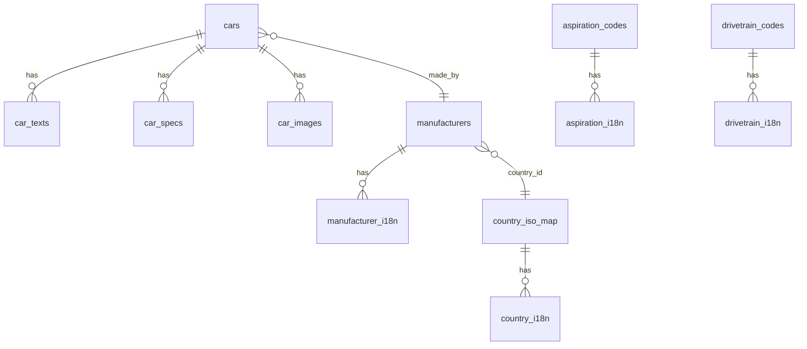
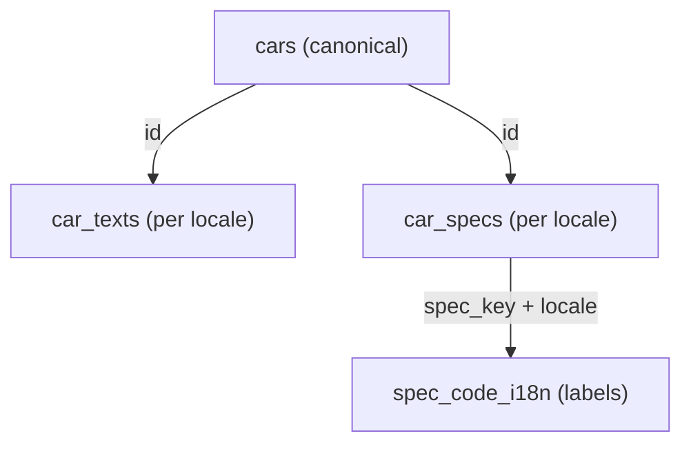

# Database Schema (Detailed)

[English](DB_SCHEMA.md) | [简体中文](DB_SCHEMA.zh-CN.md)

This document describes the GT7 dataset schema, table purposes, relationships, and query patterns.

## Overview
The database is optimized for:
- A canonical language snapshot of each car in `cars`
- Per-locale text in `car_texts`
- Per-locale specs in `car_specs` and label translations in `spec_code_i18n`
- Code-to-label mappings for aspiration and drivetrain
- Optional image storage in `car_images`
- Country mapping via `country_iso_map` and `country_i18n`

## Design Invariants (How to Read the Data)
- `cars` and `manufacturers` are canonical tables: there is a single row per entity.
- `car_texts` overlays `cars` by locale (prefer `car_texts` when present).
- `car_specs` is per-locale and is replaced per `(car_id, locale)` on each scrape run.
- `spec_code_i18n` stores translated labels for normalized `spec_key` codes per locale.
- `raw_json` in `cars` preserves the original parsed payload for traceability and fallbacks.

## Entity Relationships


## Canonical vs Localized Overlay (Conceptual)


## Tables

### cars
Canonical language fields (controlled by `--base-locale`).

Columns:
- `id` (PK)
- `name`
- `manufacturer_id` (FK → manufacturers.id)
- `aspiration_code` (FK → aspiration_codes.code)
- `drivetrain_code` (FK → drivetrain_codes.code)
- `intro`
- `detail`
- `car_class`
- `pp`
- `year`
- `raw_json` (original parsed payload for traceability)

Notes:
- `intro/detail` are canonical and can be overridden by localized `car_texts`.
- `raw_json` preserves `countryId` and other fields from the source.

### car_texts
Localized text per car.

Columns:
- `car_id` (PK, FK → cars.id)
- `locale` (PK)
- `name`
- `intro`
- `detail`

### car_specs
Localized specs per car.

Columns:
- `id` (PK)
- `car_id` (FK → cars.id)
- `locale`
- `spec_key` (normalized key like `max_power`, `weight`)
- `spec_value` (raw numeric string)
- `spec_unit` (unit string)
- `spec_raw` (raw text as displayed on the site)
- `sort_order`

Notes:
- Power/torque values are split into base + rpm rows.
- Labels are translated via `spec_code_i18n`.

### spec_code_i18n
Translations for `spec_key` values.

Columns:
- `code` (PK)
- `locale` (PK)
- `label`

### manufacturers
Canonical manufacturer info.

Columns:
- `id` (PK)
- `name`
- `logo_path` (local file path)
- `country_id` (GT7 country id, e.g., `carctry5`)

### manufacturer_i18n
Localized manufacturer names.

Columns:
- `id` (PK, FK → manufacturers.id)
- `locale` (PK)
- `name`

### aspiration_codes / aspiration_i18n
Aspiration code normalization and translations.

`aspiration_codes`:
- `code` (PK)
- `default_name`

`aspiration_i18n`:
- `code` (PK, FK → aspiration_codes.code)
- `locale` (PK)
- `label`

### drivetrain_codes / drivetrain_i18n
Drivetrain code normalization and translations.

`drivetrain_codes`:
- `code` (PK)
- `default_name`

`drivetrain_i18n`:
- `code` (PK, FK → drivetrain_codes.code)
- `locale` (PK)
- `label`

### country_iso_map
Maps GT7 `countryId` to ISO3.

Columns:
- `country_id` (PK)
- `iso3`

### country_i18n
Localized country names keyed by ISO3.

Columns:
- `iso3` (PK)
- `locale` (PK)
- `name`

### car_images
Optional image storage (table is not created when running with `--skip-images`).

Columns:
- `id` (PK)
- `car_id` (FK → cars.id)
- `image_path` (local file path)
- `sort_order`
- `image_type` (`hero` or `thumb`)

### fetch_log
Fetch history per car and locale.

Columns:
- `id` (PK)
- `car_id`
- `locale`
- `status` (`success` / `failed`)
- `message`
- `updated_at`

### meta
Dataset metadata.

Columns:
- `key` (PK)
- `value`

Common keys:
- `site_total_count`
- `scraped_total_count`
- `status`

## Locale Strategy
- `cars` stores canonical language only.
- `car_texts` stores localized `name/intro/detail`.
- `car_specs` stores localized spec rows with original units.
- `spec_code_i18n` provides label translations for `spec_key`.

## Country Mapping Strategy
- `manufacturers.country_id` stores the GT7 country id.
- `country_iso_map` maps `country_id` → ISO3.
- `country_i18n` maps ISO3 → localized country name.

## Query Patterns

### Localized car details
```sql
SELECT
  c.id,
  COALESCE(t.name, c.name) AS name,
  COALESCE(t.intro, c.intro) AS intro,
  COALESCE(t.detail, c.detail) AS detail
FROM cars c
LEFT JOIN car_texts t ON t.car_id = c.id AND t.locale = 'cn'
WHERE c.id = 'car31';
```

### Specs with translated labels
```sql
SELECT
  s.spec_key,
  i.label AS spec_label,
  s.spec_value,
  s.spec_unit,
  s.spec_raw
FROM car_specs s
LEFT JOIN spec_code_i18n i
  ON i.code = s.spec_key AND i.locale = s.locale
WHERE s.car_id = 'car31' AND s.locale = 'cn'
ORDER BY s.sort_order;
```

### Manufacturer + country name
```sql
SELECT
  COALESCE(mi.name, m.name) AS manufacturer,
  COALESCE(ci.name, cigb.name, cim.iso3, m.country_id) AS country
FROM manufacturers m
LEFT JOIN manufacturer_i18n mi ON mi.id = m.id AND mi.locale = 'cn'
LEFT JOIN country_iso_map cim ON cim.country_id = m.country_id
LEFT JOIN country_i18n ci ON ci.iso3 = cim.iso3 AND ci.locale = 'cn'
LEFT JOIN country_i18n cigb ON cigb.iso3 = cim.iso3 AND cigb.locale = 'gb'
WHERE m.id = 'tnr28';
```

### Sort by max power
```sql
SELECT c.id, c.name, s.spec_value
FROM cars c
LEFT JOIN car_specs s
  ON s.car_id = c.id AND s.locale = 'gb' AND s.spec_key = 'max_power'
ORDER BY CAST(REPLACE(s.spec_value, ',', '') AS REAL) DESC
LIMIT 20;
```

## Operational Notes
- `car_images` is created only when images are downloaded.
- `country_iso_map` and `country_i18n` are overwritten by mapping JSON on each run.
- `raw_json` is the fallback source if mapping tables are missing.
- For multi-locale datasets, run your base locale first (`--base-locale`) so canonical tables are populated correctly.
