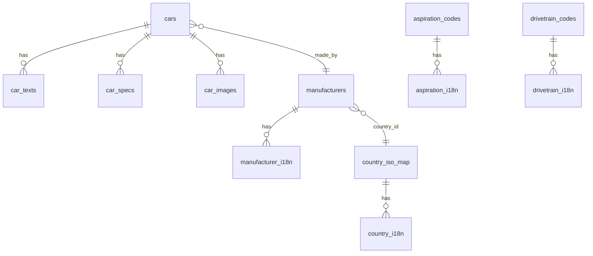
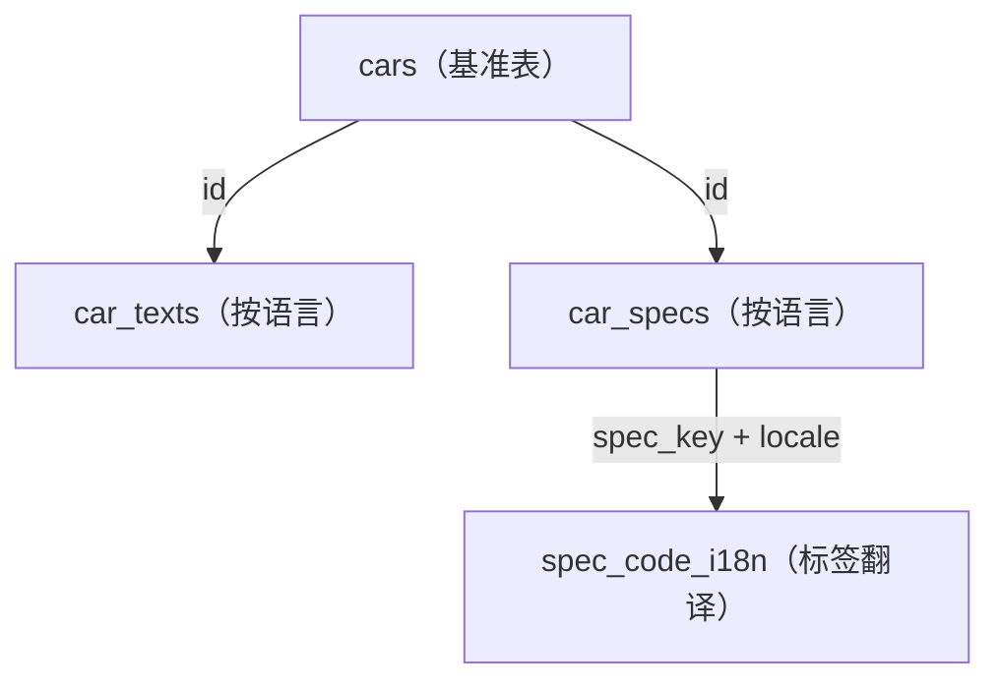

# 数据库结构（详细版）

[English](DB_SCHEMA.md) | [简体中文](DB_SCHEMA.zh-CN.md)

本文说明 GT7 数据库的结构、表含义、关系与查询范式。

## 概览
数据库设计目标：
- `cars` 保存基准语言的快照
- `car_texts` 保存多语言文本
- `car_specs` 保存多语言规格，`spec_code_i18n` 提供标签翻译
- `aspiration` 与 `drivetrain` 使用 code + i18n
- 图片为可选表 `car_images`
- 国家映射使用 `country_iso_map` + `country_i18n`

## 设计约束（如何理解数据）
- `cars` 与 `manufacturers` 是“基准表”：每个实体只有一行。
- `car_texts` 按 locale 覆盖 `cars` 的可本地化字段（读取时优先使用 `car_texts`）。
- `car_specs` 为按 locale 存储的规格行，爬虫会按 `(car_id, locale)` 进行替换写入。
- `spec_code_i18n` 存放规范化 `spec_key` 的多语言标签。
- `cars.raw_json` 保存原始解析 payload，用于追溯与回退解析。

## 关系图


## 基准表与本地化覆盖（概念图）


## 表说明

### cars
基准语言字段（由 `--base-locale` 控制）。

字段：
- `id` (PK)
- `name`
- `manufacturer_id` (FK → manufacturers.id)
- `aspiration_code` (FK → aspiration_codes.code)
- `drivetrain_code` (FK → drivetrain_codes.code)
- `intro`
- `detail`
- `car_class`
- `pp`
- `year`
- `raw_json`（原始解析数据）

说明：
- `intro/detail` 可被本地化 `car_texts` 覆盖。
- `raw_json` 保留 `countryId` 等字段。

### car_texts
车辆多语言文本。

字段：
- `car_id` (PK, FK → cars.id)
- `locale` (PK)
- `name`
- `intro`
- `detail`

### car_specs
多语言规格。

字段：
- `id` (PK)
- `car_id` (FK → cars.id)
- `locale`
- `spec_key`（规范化 key）
- `spec_value`（数值文本）
- `spec_unit`（单位文本）
- `spec_raw`（原始展示文本）
- `sort_order`

说明：
- 功率/扭矩会拆成基础值 + rpm 两行。
- 标签翻译来自 `spec_code_i18n`。

### spec_code_i18n
规格标签翻译。

字段：
- `code` (PK)
- `locale` (PK)
- `label`

### manufacturers
厂商信息（基准语言）。

字段：
- `id` (PK)
- `name`
- `logo_path`
- `country_id`（GT7 国家 id，例如 `carctry5`）

### manufacturer_i18n
厂商名称多语言。

字段：
- `id` (PK, FK → manufacturers.id)
- `locale` (PK)
- `name`

### aspiration_codes / aspiration_i18n
进气形式 code + 翻译。

`aspiration_codes`:
- `code` (PK)
- `default_name`

`aspiration_i18n`:
- `code` (PK, FK → aspiration_codes.code)
- `locale` (PK)
- `label`

### drivetrain_codes / drivetrain_i18n
传动系统 code + 翻译。

`drivetrain_codes`:
- `code` (PK)
- `default_name`

`drivetrain_i18n`:
- `code` (PK, FK → drivetrain_codes.code)
- `locale` (PK)
- `label`

### country_iso_map
GT7 `countryId` → ISO3 映射。

字段：
- `country_id` (PK)
- `iso3`

### country_i18n
ISO3 → 多语言国家名称。

字段：
- `iso3` (PK)
- `locale` (PK)
- `name`

### car_images
图片表（使用 `--skip-images` 时不会创建）。

字段：
- `id` (PK)
- `car_id` (FK → cars.id)
- `image_path`
- `sort_order`
- `image_type`（`hero` / `thumb`）

### fetch_log
抓取日志。

字段：
- `id` (PK)
- `car_id`
- `locale`
- `status`
- `message`
- `updated_at`

### meta
元数据。

字段：
- `key` (PK)
- `value`

常见键：
- `site_total_count`
- `scraped_total_count`
- `status`

## 语言策略
- `cars` 只保存基准语言。
- `car_texts` 保存多语言文本。
- `car_specs` 保存多语言规格与原始单位。
- `spec_code_i18n` 提供标签翻译。

## 国家映射策略
- `manufacturers.country_id` 保存 GT7 国家 id。
- `country_iso_map` 做 ISO3 映射。
- `country_i18n` 做国家名称多语言。

## 常用查询

### 本地化车辆详情
```sql
SELECT
  c.id,
  COALESCE(t.name, c.name) AS name,
  COALESCE(t.intro, c.intro) AS intro,
  COALESCE(t.detail, c.detail) AS detail
FROM cars c
LEFT JOIN car_texts t ON t.car_id = c.id AND t.locale = 'cn'
WHERE c.id = 'car31';
```

### 规格 + 标签翻译
```sql
SELECT
  s.spec_key,
  i.label AS spec_label,
  s.spec_value,
  s.spec_unit,
  s.spec_raw
FROM car_specs s
LEFT JOIN spec_code_i18n i
  ON i.code = s.spec_key AND i.locale = s.locale
WHERE s.car_id = 'car31' AND s.locale = 'cn'
ORDER BY s.sort_order;
```

### 厂商 + 国家名称
```sql
SELECT
  COALESCE(mi.name, m.name) AS manufacturer,
  COALESCE(ci.name, cigb.name, cim.iso3, m.country_id) AS country
FROM manufacturers m
LEFT JOIN manufacturer_i18n mi ON mi.id = m.id AND mi.locale = 'cn'
LEFT JOIN country_iso_map cim ON cim.country_id = m.country_id
LEFT JOIN country_i18n ci ON ci.iso3 = cim.iso3 AND ci.locale = 'cn'
LEFT JOIN country_i18n cigb ON cigb.iso3 = cim.iso3 AND cigb.locale = 'gb'
WHERE m.id = 'tnr28';
```

### 按马力排序
```sql
SELECT c.id, c.name, s.spec_value
FROM cars c
LEFT JOIN car_specs s
  ON s.car_id = c.id AND s.locale = 'gb' AND s.spec_key = 'max_power'
ORDER BY CAST(REPLACE(s.spec_value, ',', '') AS REAL) DESC
LIMIT 20;
```

## 运行说明
- `car_images` 只有在启用图片下载时创建。
- `country_iso_map` 与 `country_i18n` 每次运行会被映射 JSON 覆盖。
- 若映射表缺失，可从 `raw_json` 回退解析。
- 多语言数据集建议先跑基准语言（`--base-locale`）以保证基准表写入正确。
